# Research AI Assistant 🚀

AI-assisted academic productivity application built with Flutter.

Research AI Assistant helps students and researchers organize research workflows using AI-assisted summaries, PDF extraction, research notes, experiment tracking, and documentation generation.

---

# Features

- AI-assisted research paper summaries
- PDF paper upload and text extraction
- AI research chat assistant
- Saved summaries with favorites
- Research notes management
- Experiment tracker
- Project README generator
- Local persistent storage
- Modern dark UI
- Gemini API integration with local fallback system

---

# Tech Stack

## Frontend
- Flutter
- Dart

## Local Storage
- SharedPreferences

## AI Integration
- Gemini API
- AI-assisted summarization
- Research workflow assistance

## Packages
- HTTP
- Syncfusion PDF
- File Picker
- Image Picker

---

# Screenshots

<table>
<tr>
<td align="center"><b>First Page</b> 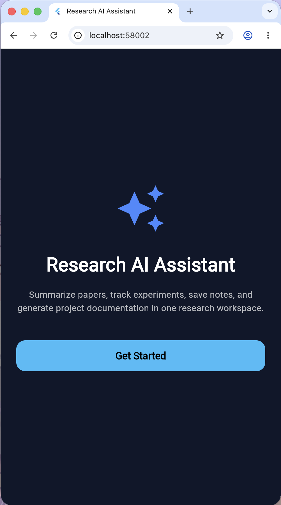</td>
<td align="center"><b>Login Page</b> 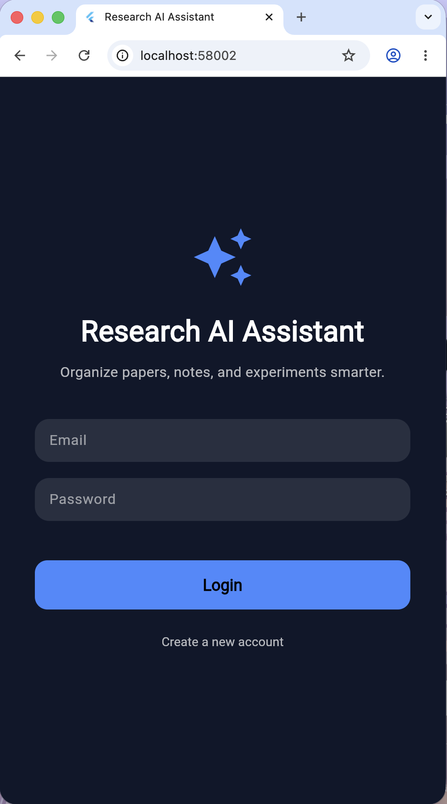</td>
<td align="center"><b>Create Account</b> 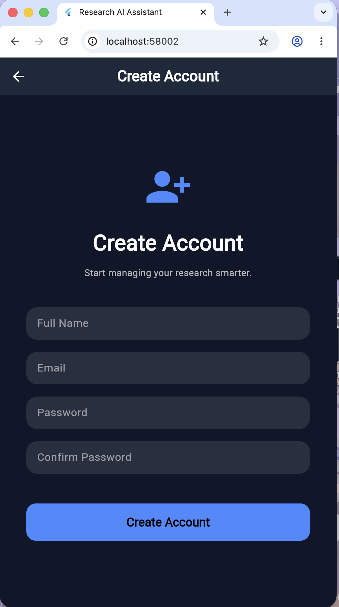</td>
</tr>

<tr>
<td align="center"><b>Dashboard</b> 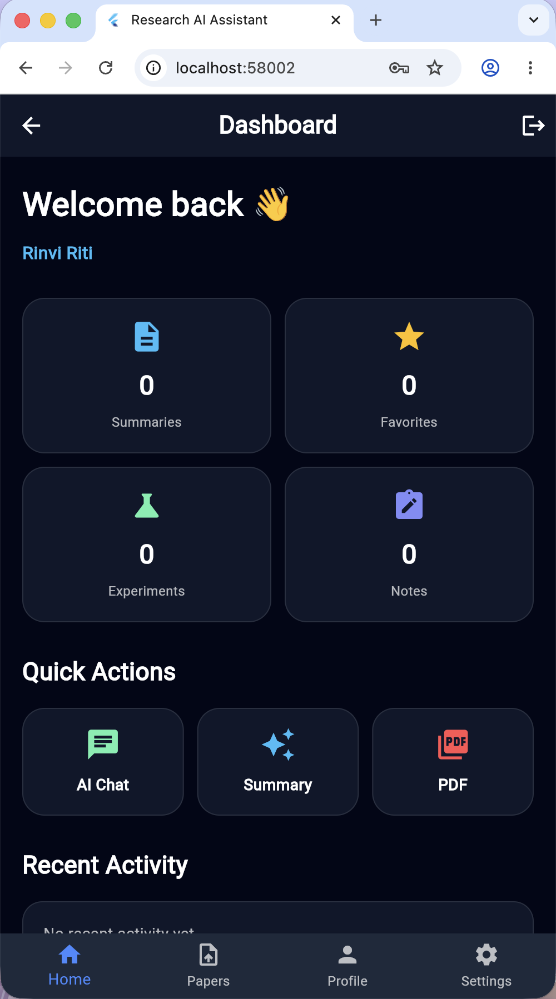</td>
<td align="center"><b>Features</b> 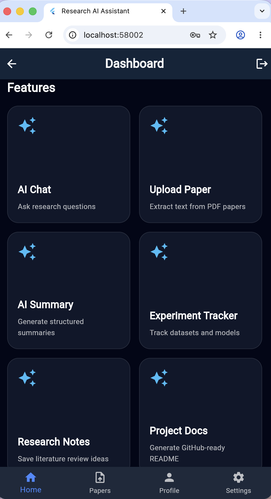</td>
<td align="center"><b>AI Summary</b> 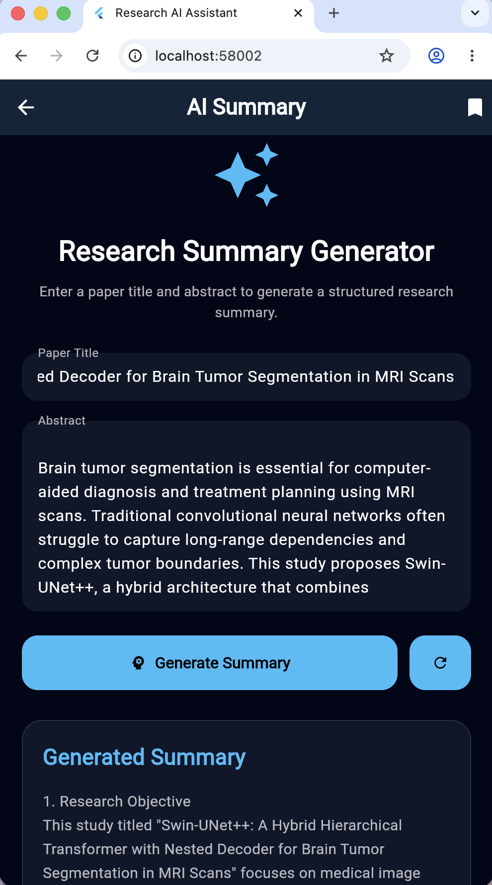</td>
</tr>

<tr>
<td align="center"><b>AI Chat</b> 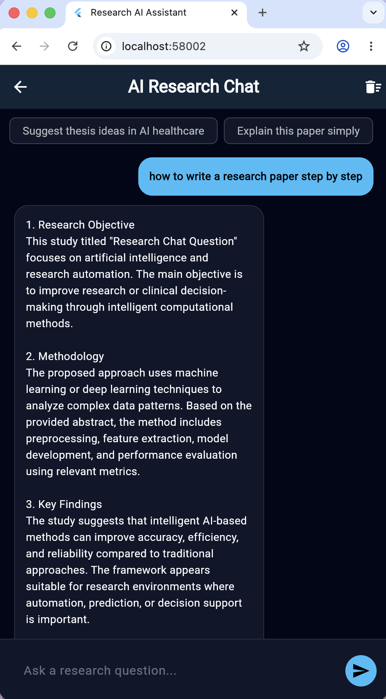</td>
<td align="center"><b>Research Notes</b> 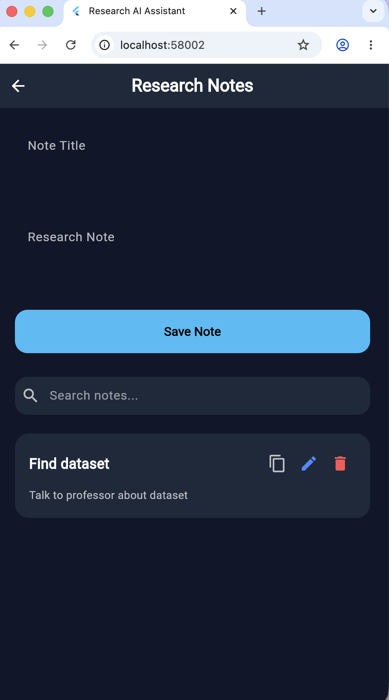</td>
<td align="center"><b>Experiment Tracker</b> 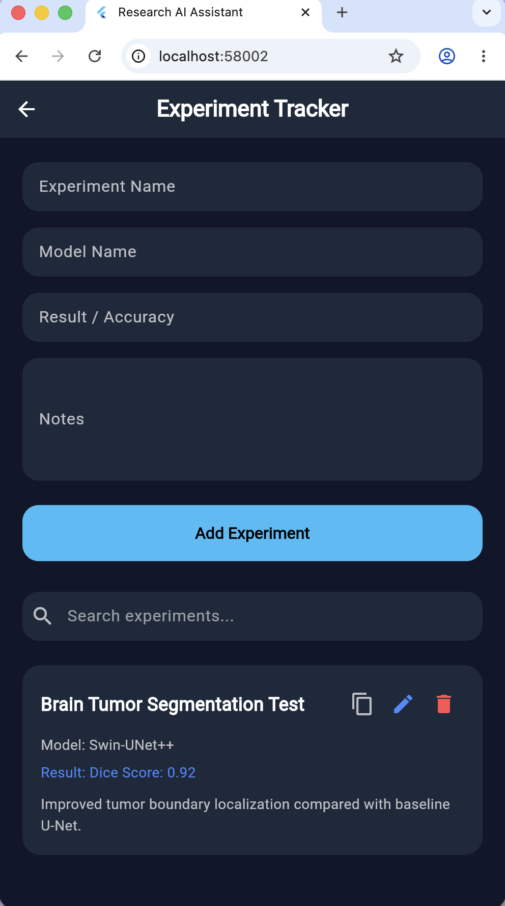</td>
</tr>

<tr>
<td align="center"><b>README Generator</b> 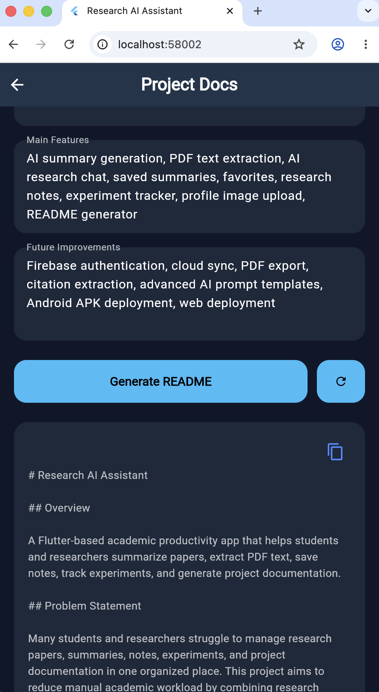</td>
<td align="center"><b>Profile Page</b> 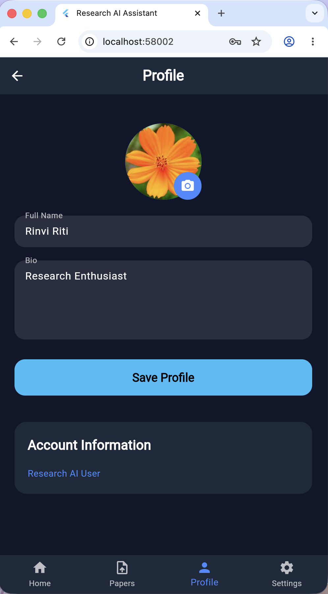</td>
<td align="center"><b>About Page</b> 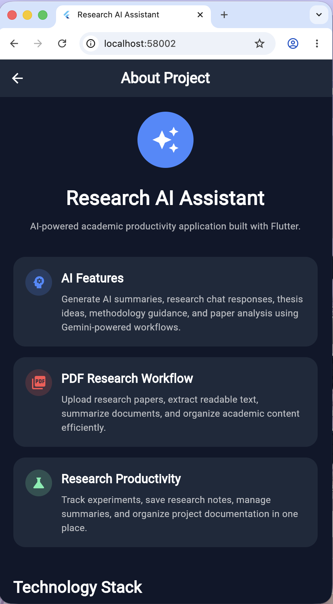</td>
</tr>

<tr>
<td align="center"><b>About Page 2</b> 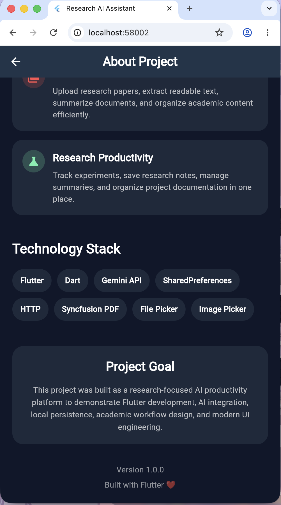</td>
<td align="center"><b>Settings</b> 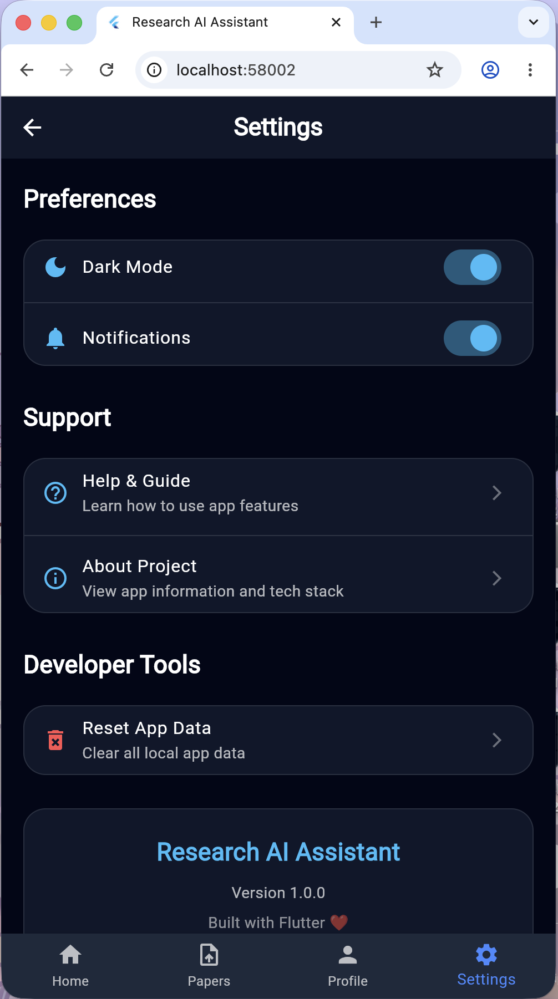</td>
<td></td>
</tr>
</table>

---

# AI Functionality Note

This project includes Gemini API integration for AI-assisted summarization and research chat.

If the Gemini API key is unavailable, quota-limited, or missing, the application automatically switches to a local fallback response system so the app remains functional for testing and demonstration purposes.

The AI Summary, AI Chat, and README Generator should therefore be considered AI-assisted workflow prototypes rather than production-grade LLM systems.

---

# Current Progress

- [x] Authentication system
- [x] Dashboard and navigation
- [x] AI summary generator
- [x] PDF upload and extraction
- [x] AI research chat
- [x] Saved summaries
- [x] Research notes
- [x] Experiment tracker
- [x] README generator
- [x] Profile and settings
- [x] Local persistence
- [x] Modern UI design
- [ ] Firebase backend
- [ ] Cloud synchronization
- [ ] APK/Web deployment

---

# Future Improvements

- Firebase Authentication
- Cloud Firestore database
- Real Gemini AI reasoning
- Citation extraction
- PDF export
- Cloud synchronization
- APK/Web deployment
- Better prompt engineering
- Research recommendation engine

---

# Purpose of the Project

This project was built as a portfolio project to demonstrate:

- Flutter app development
- AI integration
- Academic workflow design
- Local persistence
- Modern UI/UX
- Research productivity tools
- GitHub project organization

---

# Developer

## Rinvi Jaman Riti

- GitHub: https://github.com/rinviriti
- LinkedIn: https://www.linkedin.com/in/rinvi-jaman

---
